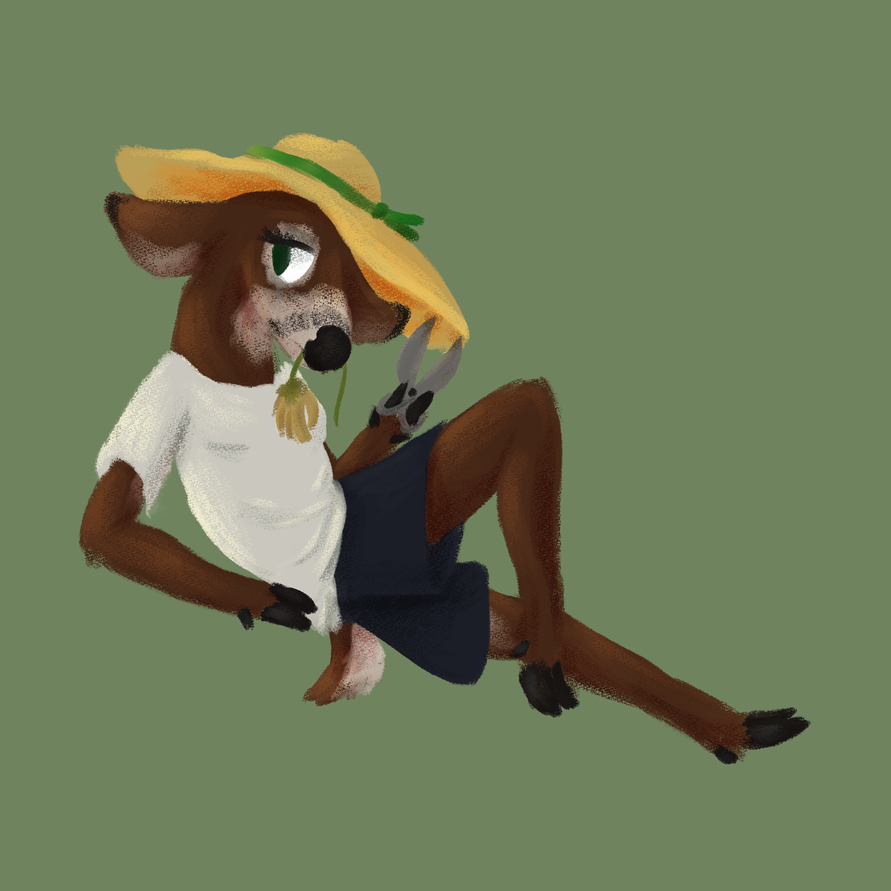

# Rust Image Toolkit
Simple tool used for image manipulation/analysis, written in Rust. For learning.

Current list of commands. Each [brackets] represent a filepath to an image (preferably PNG).
Use underscores (`_`) as placeholder textures. 
- `mask [mask_a] [mask_b] [output]`
  - Returns a weighted sum of two masks, as well as an image result (masks are multiplied)
  - Mask A is used for weighting, mask B is the mask to sum
  - sum = (Σ weight * overlay) / (Σ weight)
  - Stores as **Luma16**.
- `pack [channel_r] [channel_g] [channel_b] [channel_a] [output]`
  - Packs multiple texture channels into one. Useful for PBR maps.
  - Only the Red, Green, Blue, and Alpha channel are sampled from their respective texture inputs.
  - Stores as **RGBA8** with alpha, or **RGB8** if no alpha is provided.
- `flipnorm [texture] [output]`
  - Flips the green channel of a given texture.
  - Used to convert between DirectX and OpenGL normal maps.
  - Stores as **RGB16**.

